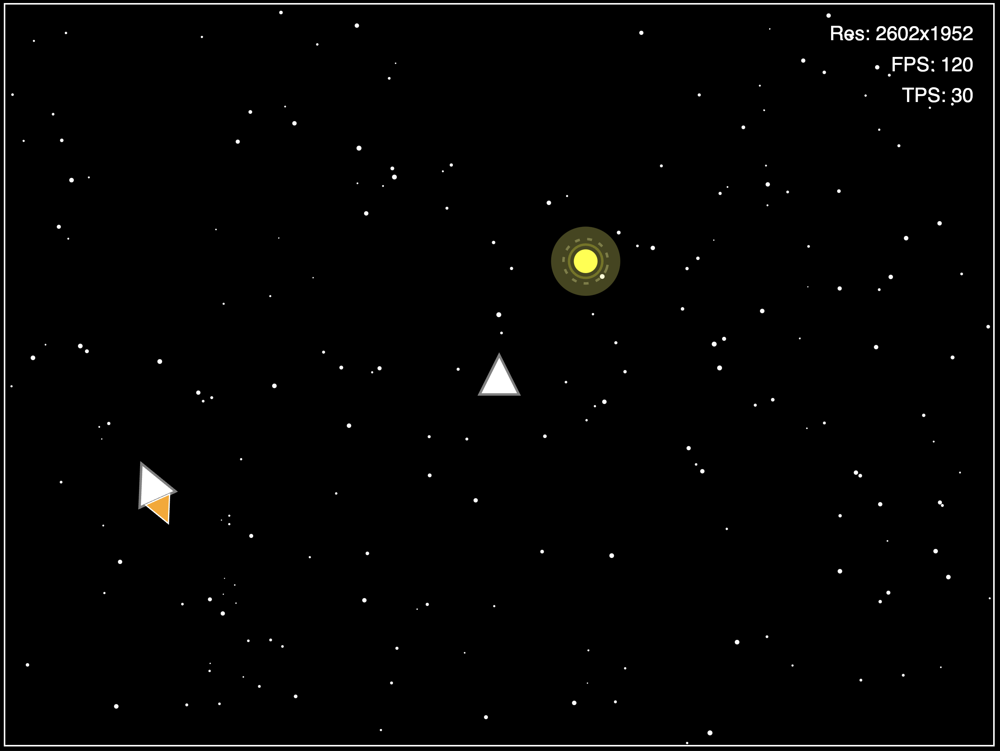
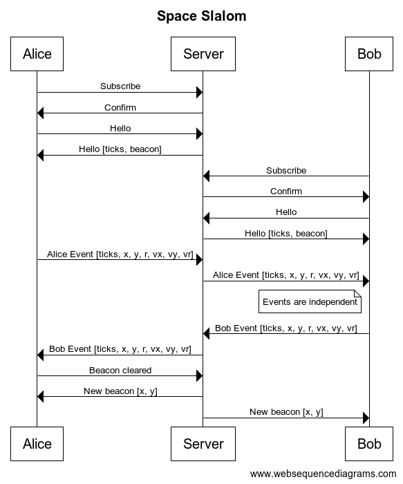

# Space Slalom

Space Slalom is a multiplayer web game implemented
with a Ruby on Rails backend, a JavaScript frontend, and a WebSockets network transport. 

Each player drives a spaceship and tries to collect pulsating yellow beacons.

Try it out: http://spaceslalom.barlasgarden.com



## Controls

Desktop:

- A, Left Arrow - left turn
- D, Right Arrow - right turn
- W, Up Arrow - thrust

Mobile:

- Touch left third - left turn
- Touch middle third - thrust
- Touch right third - right turn

## Project

The relevant code snippets for Space Slalom are:

- [public/index.html](public/index.html) - Game client
- [app/channels/game_channel.rb](app/channels/game_channel.rb) - Server WebSocket handling
- [app/channels/game_state.rb](app/channels/game_state.rb) - Server game state

Space Slalom is a Ruby on Rails project initially created with the following:

```
rails new spacewars \
  --skip-active-record \
  --skip-action-mailbox \
  --skip-action-text \
  --skip-action-mailer \
  --skip-test \
  --skip-system-test \
  --skip-sprockets \
  --skip-javascript
```

## Run

```
bundle exec ./bin/rails server
```

## Networking

The sequence diagram below details a simple example of an event sequence
between players, Alice and Bob, and the server.


